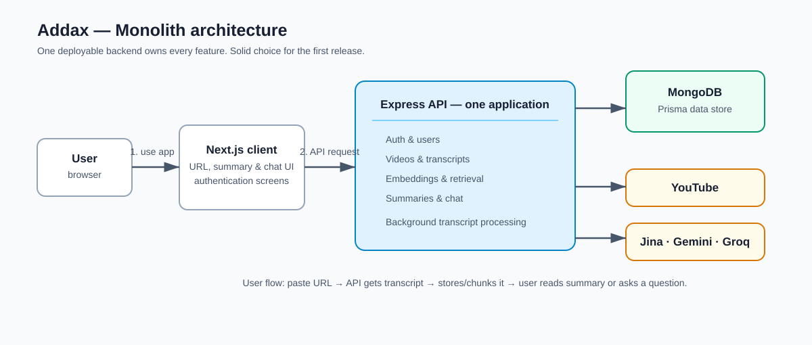
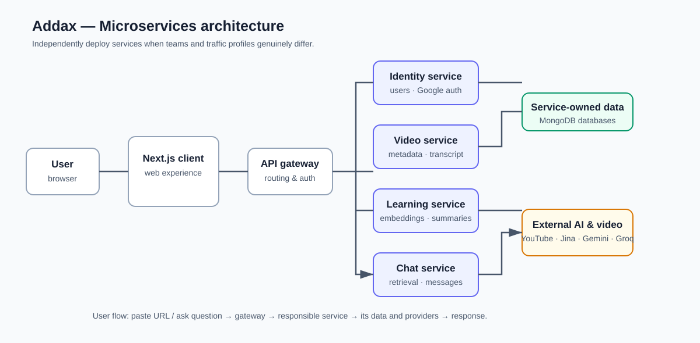
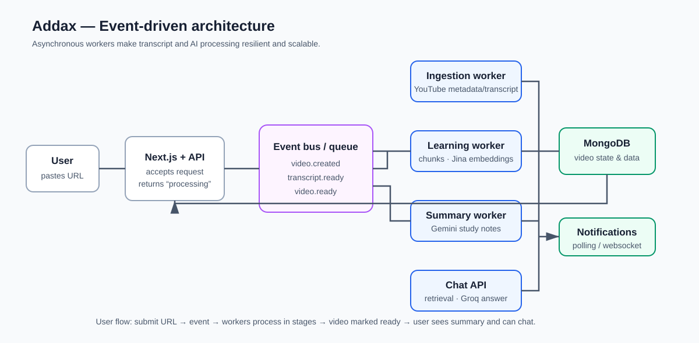

# Addax architecture options

The diagrams describe the existing Addax product: a Next.js client, Express API, MongoDB/Prisma, YouTube transcript ingestion, Jina embeddings, Gemini summaries, and Groq-powered Q&A.

## 1. Monolith — best choice now

Keep one Express deployment, but organize its code by feature modules (auth, video, transcript, summary, chat). The current implementation already follows this shape. Add a durable job queue for long transcript/embedding work before considering a full event-driven rebuild.

## 2. Microservices — use later for independent teams or scaling

This supports independent releases and scaling, but introduces network calls, API contracts, service ownership, observability, and more operational cost. It is premature for the current scope.

## 3. Event-driven — use for high-volume asynchronous processing

This is strongest when many video imports need retries, buffering, and independent worker scaling. It should be adopted incrementally: first add a queue to the monolith, then extract workers only when the load justifies it.

## Recommendation

Choose a **modular monolith with a durable background-job queue**. It is the simplest model for a small product and one codebase, while solving Addax's main asynchronous need—transcript ingestion and AI processing. Keep the `Video.status` lifecycle as the client contract, introduce queue events internally, and defer microservices until separate teams or sustained traffic make independent deployment valuable.
